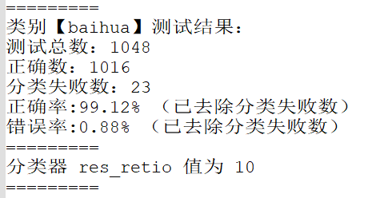
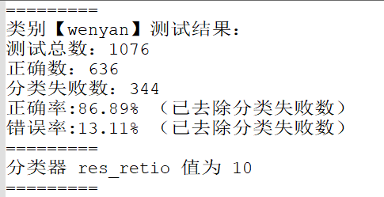

# 根据朴素贝叶斯进行白话与文言的辨识

具体原理及使用方法请参见博客文章（撰写中），但原理简单、程序结构清晰，本为练习项目，应该不难理解。

模型使用了文言、白话各`100000`句，得到的效果还算不错。

文言的训练集用量可能还是不足...

## 数据集

感谢这个仓库及作者们收集的文言翻译

[NiuTrans/Classical-Modern](https://github.com/NiuTrans/Classical-Modern)